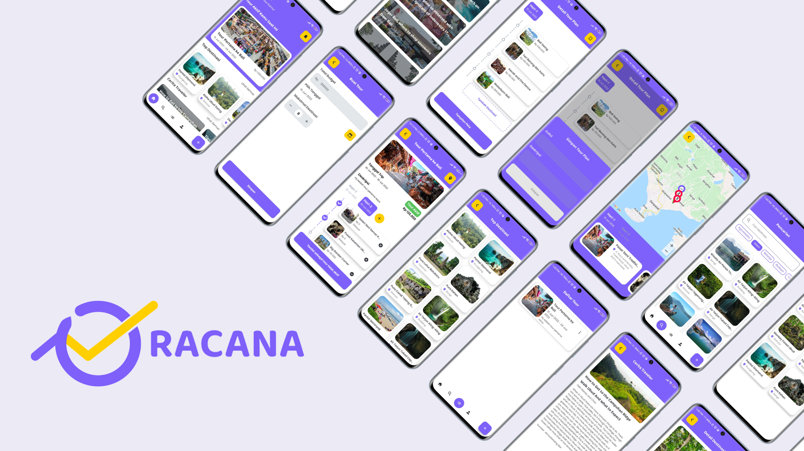

<!-- PROJECT LOGO -->
 

  

<h3 align="center">Racana</h3>
  
Visit Your Dream Destination with The Best Budget

  

    <a href="https://github.com/ekotyoo/Racana">View Demo</a>
    ·
    <a href="https://github.com/ekotyoo/Racana/issues">Report Bug</a>
    ·
    <a href="https://github.com/ekotyoo/Racana/issues">Request Feature</a>
  

<!-- TABLE OF CONTENTS -->

  
Table of Contents

  <ol>
    <li>
      <a href="#about-the-project">About The Project</a>
      <ul>
        <li><a href="#built-with">Built With</a></li>
      </ul>
    </li>
    <li>
      <a href="#getting-started">Getting Started</a>
      <ul>
        <li><a href="#prerequisites">Prerequisites</a></li>
        <li><a href="#installation">Installation</a></li>
      </ul>
    </li>
    <li><a href="#usage">Usage</a></li>
    <li><a href="#roadmap">Roadmap</a></li>
    <li><a href="#contributing">Contributing</a></li>
    <li><a href="#license">License</a></li>
    <li><a href="#contact">Contact</a></li>
    <li><a href="#acknowledgments">Acknowledgments</a></li>
  </ol>

<!-- ABOUT THE PROJECT -->
## About The Project

A friendly application for tourists in making their itinerary with a recommended destination on their preferences and budgets.

(<a href="#top">back to top</a>)

### Built With

* [Native Android](https://www.android.com/)
* [Express.js](https://reactjs.org/)
* [Flask](https://palletsprojects.com/)
* [Tensorflow](https://www.tensorflow.org/)

(<a href="#top">back to top</a>)

<!-- GETTING STARTED -->
## Getting Started

To use this app follow these simple example steps.

### Installation

1. Download the .apk file.
2. Copy the file to your Androi phone.
3. Install the app and enjoy!

(<a href="#top">back to top</a>)

<!-- USAGE EXAMPLES -->
## Features

* Authentication using JWT token.
* Generate itinerary based on your budget preferences.
* Save and customize itinerary.
* View your tour route in map mode.
* Explore beautiful destinations in Bali.

(<a href="#top">back to top</a>)

<!-- ROADMAP -->
## Branches

* [Android](https://github.com/ekotyoo/Racana/tree/racana-mobile)
* [Express.js Backend](https://github.com/ekotyoo/Racana/tree/racana-api-express)
* [Flask Backend](https://github.com/ekotyoo/Racana/tree/racana-api-flask)
* [Machine Learning](https://github.com/ekotyoo/Racana/tree/racana-ml)

(<a href="#top">back to top</a>)

